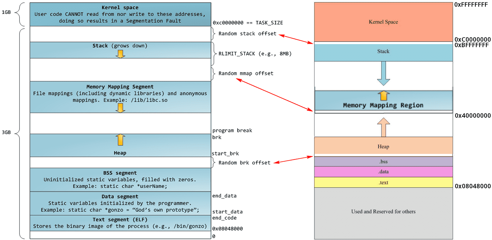
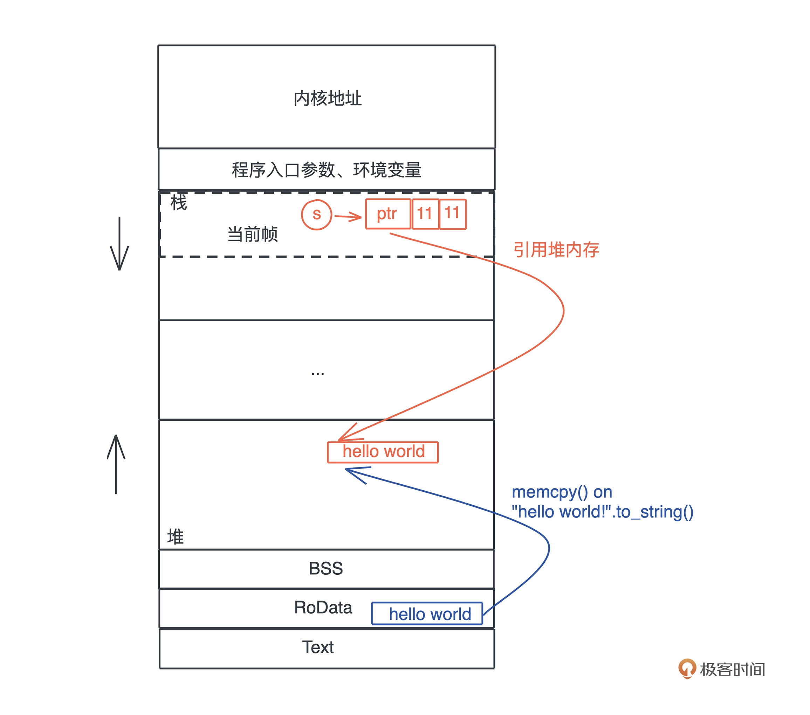
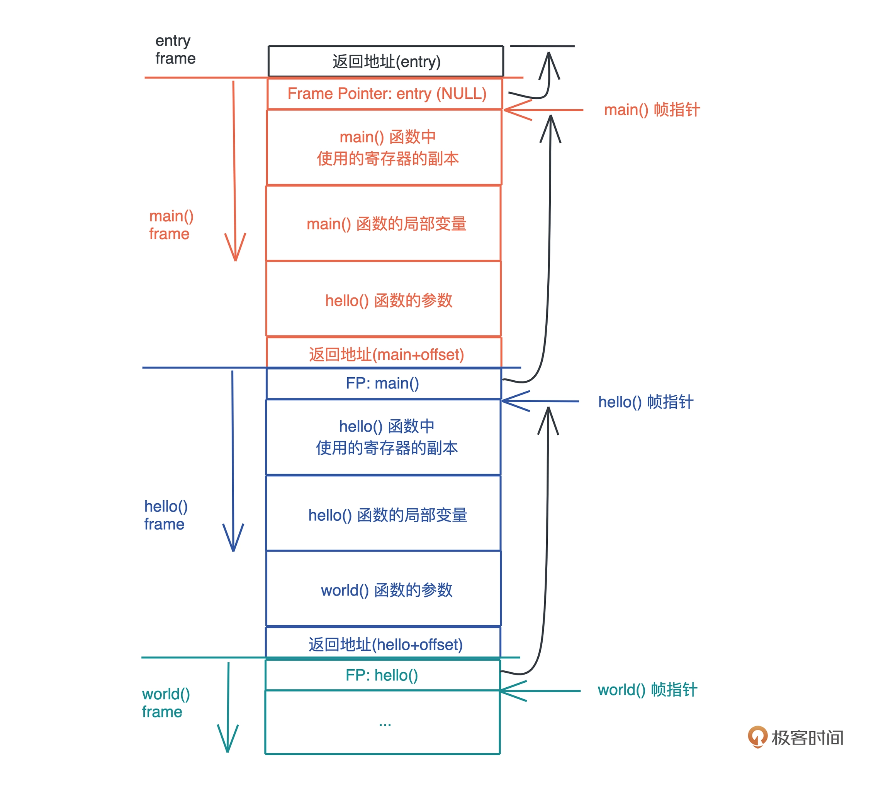

# process memory



先看下面一个简单的例子

```rust
fn main() {
    let s = "hello world".to_string();
    
    println!("addr of ss: {:p}, s: {:p}, len: {}, capacity: {}, size: {}", 
        &"hello world", &s, s.len(), s.capacity(), std::mem::size_of_val(&s));
}
```

对应的内容布局如下：


字符串常量，在编译时就会放到`RoData`段，其类型是`str`；而`&str.to_string`方法会将字符串拷贝到`heap`中，并返回一个`String`值；`str`的大小是不固定的，因此无法分配在栈上，我们一般都是通过`&str`来引用，`&str`是一个胖指针，包括字符串的起始地址和长度；`String`是可变字符串，包含堆中的一个字符数组引用，字符数组总长度，当前使用的长度，其结构如下：

```rust
pub struct String {
    vec: Vec<u8>,
}

pub struct Vec<T, #[unstable(feature = "allocator_api", issue = "32838")] A: Allocator = Global> {
    buf: RawVec<T, A>,
    len: usize,
}

pub(crate) struct RawVec<T, A: Allocator = Global> {
    ptr: Unique<T>,
    cap: usize,
    alloc: A,
}

pub struct Global;
```
`String`的内存占用大小是固定的

## stack



栈是自顶向下增长的，每当一个函数被调用时，一块连续的内存就会在栈顶被分配出来，这块内存被称为帧（frame），函数内的局部变量会被分配在该栈帧中，函数返回时，该帧会被释放，函数内的局部变量就会被销毁；

比如下面代码有造成 dangling pointer：

```rust
fn new_person() -> &Person {
    &Person{
        ...
    }
}
```

局部变量在函数返回时就会被释放，好在rust的所有权系统会阻止上面代码的编译；

函数栈帧大小在编译期间就确定了；在编译并优化代码的时候，一个函数就是一个最小的编译单元。在这个函数里，编译器得知道要用到哪些寄存器、栈上要放哪些局部变量，明确每个局部变量的大小，这样编译器就知道需要分配多大的栈帧了；

**在编译时，一切无法确定大小或者大小可以改变的数据，都无法安全地放在栈上，最好放在堆上。**

比如，对于下面方法：

```rust
fn echo(v: str) {
    ...
}
```

`str`表示字符串常量，其大小无法在编译时确定，这时候编译器就不知道需要分配多大的栈帧，因此该代码无法正常编译，这也是为什么我们使用`&str`的原因，`&str`本身占用16byte，是明确知道其大小的；

栈上的内存分配是非常高效的。只需要改动栈指针（stack pointer），就可以预留相应的空间；把栈指针改动回来，预留的空间又会被释放掉。预留和释放只是动动寄存器，不涉及额外计算、不涉及系统调用，因而效率很高。

所以理论上说，**只要可能，我们应该把变量分配到栈上，这样可以达到更好的运行速度。**

栈的一个主要问题是，操作系统会限制栈的最大大小（可以手动修改），当分配栈帧时，如果栈空间不足，会发生`stack overflow`异常，从而导致程序被终止。

## heap

栈虽然使用起来很高效，但它的局限也显而易见。**当我们需要动态大小的内存时，只能使用堆**，比如可变长度的数组、列表、哈希表、字典，它们都分配在堆上。

堆内存的分配相对来说代价是比较昂贵的，因此分配内存时，一般都会预留一些空间，避免修改时需要重复申请内存；

除了动态大小的内存需要被分配到堆上外，**动态生命周期的内存也需要分配到堆上。**

前面讲到，栈上的内存在函数调用结束之后，所使用的帧被回收，相关变量对应的内存也都被回收待用。所以栈上内存的生命周期是不受开发者控制的，并且局限在当前调用栈。

而堆上分配出来的每一块内存需要显式地释放，这就使堆上内存有更加灵活的生命周期，可以在不同的调用栈之间共享数据。

而使用堆内存，如果是手动管理内存，则存在内存泄露、重复释放、野指针异常等问题。

## 总结

对于存入栈上的值，它的大小在编译期就需要确定。栈上存储的变量生命周期在当前调用栈的作用域内，无法跨调用栈引用。

堆可以存入大小未知或者动态伸缩的数据类型。堆上存储的变量，其生命周期从分配后开始，一直到释放时才结束，因此堆上的变量允许在多个调用栈之间引用。但也导致堆变量的管理非常复杂，手工管理会引发很多内存安全性问题，而自动管理，无论是 GC 还是 ARC，都有性能损耗和其它问题。

一句话对比总结就是：栈上存放的数据是静态的，固定大小，固定生命周期；堆上存放的数据是动态的，不固定大小，不固定生命周期。
